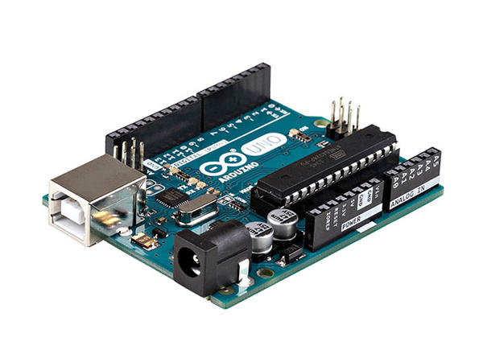

# Arduino

    Electronique / Robotique
    à partir de 11 ans
    programmation par langage de programmation ou blocs
    entre 50€ et 80€ pour un starter kit
    

L'Arduino est un micro-contrôleur conçu pour faciliter l'utilisation de l'électronique. Les montages se font sans soudure par enfichage des composants sur l'Arduino ou les plaques support.

L'objectif est d'apprendre les bases de la programmation et de la robotique au travers d'applications sur des objets 

Des ateliers ont été menés dans le cadre de Devoxx4Kids 

[Ateliers pour enfants en français](http://cfalguiere.github.io/LabRPG/#/game)

 
Le site officiel Arduino

[Arduino](hhttps://www.arduino.cc/)

----

[Retour](../../index.md)
