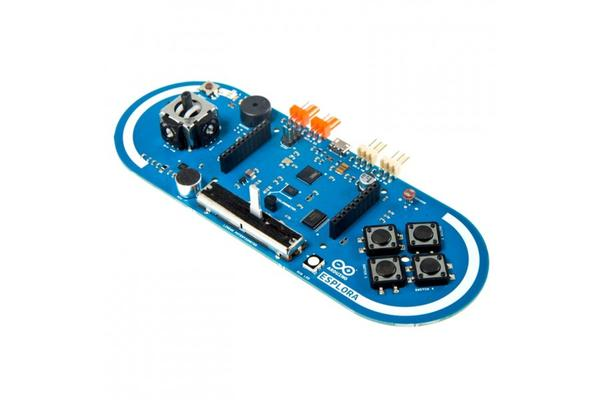

# Esplora

# Arduino

    Electronique / Robotique
    à partir de 10 ans
    programmation par langage de programmation ou blocs
    autour de 150€ pour un starter kit

L'Esplora est une variante d'[Arduino](../Arduino) conçue pour les écoles. Les composants nécessaires aux ateliers sont déjà montés sur la carte. Elle comporte des LEDs, un pad en croix, des boutons, un variateur, un capteur de température, et un écran en option.

L'Esplora fourni des librairies spécifiques qui simplifient la programmation. Il reste un Arduino et peut être utilisé exactement comme l'Arduino avec quelques adaptations.

L'objectif est d'apprendre les bases de la programmation et de la robotique au travers d'applications sur des objets 

 
Le site officiel Esplora

[Esplora](https://www.arduino.cc/en/Guide/ArduinoEsplora)

    
----

[Retour](../../index.md)
