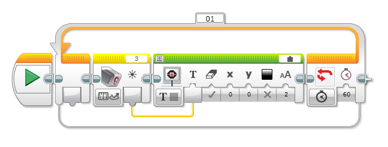

## Afficher la valeur d'un capteur

Pour afficher la valeur du capteur de lumière, on va relier l'écran du robot.

Le programme est une boucle. A chaque passage, le capteur est lu et sa valeur est affichéee. La valeur du capteur est amenée dans l'affichage par le lien en jaune.

La condition d'arrêt de la boucle utilise la durée et la valeur est 60 pour 60 secondes.

Il faut paramétrer le bloc affichage pour qu'il affiche du texte. Il faut aussi changer la source dans la barre verte. La valise représente une variable. Ici la variable est la valeur lue par le capteur. Tu peut changer la position (x et y), la couleur et la taille du texte.

Selon les prises sur lesquelles tu as branché le capteur sur ton robot,  le chiffre affecté au capteur (3) peuvent être un peu différent.

*_Variante_* : essaye avec différents capteurs
