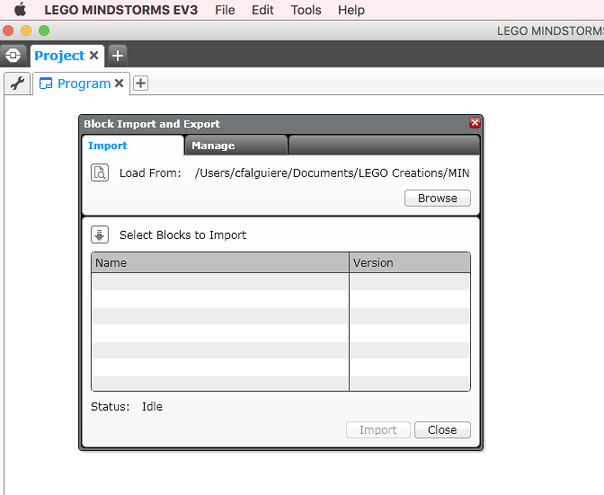

# Mindstorms

## Compléter le set EV3

Le set EV3 est fourni sous deux formes

- EV3 Home Edition (version commerciale) 
- EV3 Education Core Set (version réservée aux contextes educatifs)

L'EV3 Home Edition est fourni avec un capteur tactile, un capteur de couleur, un capteur infrarouge et la balise/télécommande infrarouge.

L'EV3 Education Core Set est fourni avec un capteur tactile, un capteur de lumière, un capteur ultrason et un capteur gyroscopique.

Les capteurs sont compatibles entre les deux sets. Vous pouvez acheter les capteurs de l'autre set. 

En revanche, vous ne verrez pas les blocks correspondant à ce capteur. 
Il faudra simplement installer un block logiciel complémentaire (Block File en anglais) pour que les blocks apparaissent. Vous pourrez alors utiliser ces capteurs dans vos programmes.

Nous allons voir comment installer le module du capteur gyro. Le mode opératoire est le même pour tous les capteurs EV3, fournis par Lego ou par des partenaires comme HiTechnic, Mindsensors, ou Dexter Industries.

### Etape 1 : Télécharger le block logiciel

Vous trouverez les blocks logiciels sur le site de Lego dans la. section ***Blocs Logiciels EV3***

[Blocks logiciels](https://www.lego.com/fr-fr/mindstorms/downloads)

Ci-dessous les liens directs vers les plus courants pour EV3 Home Edition :

[Capteur gyro (inclinaison)](https://lc-www-live-s.legocdn.com/r/www/r/mindstorms/-/media/franchises/mindstorms%202014/downloads/firmware%20and%20software/gyro.ev3b?l.r2=-2108761645)

[Capteur ultrason (distance)](https://lc-www-live-s.legocdn.com/r/www/r/mindstorms/-/media/franchises/mindstorms%202014/downloads/firmware%20and%20software/ultrasonic.ev3b?l.r2=-781618883)

[Capteur sonore](https://lc-www-live-s.legocdn.com/r/www/r/mindstorms/-/media/franchises/mindstorms%202014/downloads/firmware%20and%20software/sound.ev3b?l.r2=390540319)

[Capteur de température](https://lc-www-live-s.legocdn.com/r/www/r/mindstorms/-/media/franchises/mindstorms%202014/downloads/firmware%20and%20software/temperature.ev3b?l.r2=650481263)

### Etape 2 : Importer le block logiciel

Si vous n'êtes pas dans un projet, aller dans le logiciel EV3 et ouvrir un projet. 

Si vous êtes dans un projet, sauvez votre travail car le logiciel devra être redémarré.

Vous devrez être dans un projet pour l'import, mais l'installation se fait bien dans le logiciel EV3. Le bloc restera disponible dans tous les projets.

Aller dans Outils et choisir Importer le block

Le panneau suivant d'affiche

Utilisez le bouton Parcourir (Browse) et sélectionnez le block logiciel que vous venez de télécharger

Cliquez sur le bouton Import et confirmez la demande.

Une fois l'import terminé vous pouvez fermer ce panneau.

### Etape 3 : Redémarrer le logiciel EV3

Arrêtez le logiciel puis démarrez le à nouveau

 

### Etape 4 : Vérifier le capteur

Le capteur apparaît maintenant dans le bac jaune 

Il apparaît aussi en option du bloc wait et du bloc switch 

 

