# Mindstorms

## Utiliser les moteurs

Le Mindstorms a deux types de moteurs :
- un petit moteur à axe central
- deux gros moteurs à axe horizontal

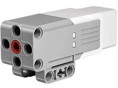
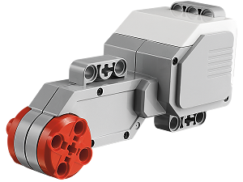

Le petit moteur à axe central permet de faire tourner des hélices ou de d'ouvrir et fermer des pinces.

Le gros moteur à axe horizontal est utilisé le plus souvent pour faire tourner les roues des véhicules. Le moteur fait tourner un axe horizontal sur lequel se trouvent les roues. Bien sûr si on le met sur le côté, on peut faire tourner un axe vertical.

### Brancher le moteur

Les moteurs sont commandés par la brique de contrôle, le cerveau du robot. Pour cela, il faut les brancher avec un des câbles plats sur un des côtés de la brique.
Si tu regardes la brique des deux côtés, tu verras qu'elle a des lettres A, B, C, D d'un côté, et des chiffres 1, 2, 3, 4 de l'autre.

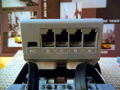
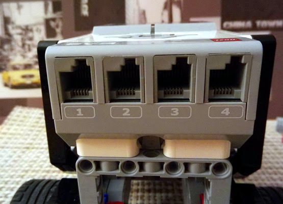

Les moteurs se branchent sur les lettres. Les chiffres eux servent pour les capteurs qu'on verra plus tard.

Par exemple, on va brancher le petit moteur sur la lettre A.

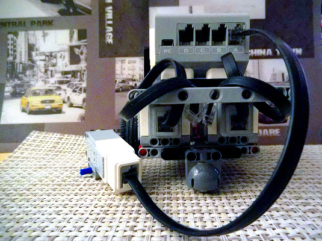

Et maintenant pour indiquer au robot ce que les moteurs doivent faire, on va écrire un programme.

### Programmer le moteur

Un programme est composé de plusieurs blocs :
- Un bloc flèche verte pour indiquer où le programme démarre. Il se trouve dans la section flux en orange
- Un ou des blocs qui indiquent les actions
- Si besoin un bloc qui arrête le programme. Il se trouve dans la section avancé bleu.

Dans notre programme on va utiliser un des blocs moteur.

Il y a quatre blocs moteur dans la section verte. Les deux premiers contrôlent le petit et le gros moteur. Les deux suivants permettent de commander 2 moteurs en même temps. Cela nous permettra, par exemple, de contrôler la direction d'un véhicule.

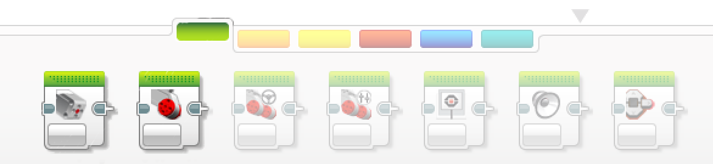

Mais pour le moment, regardons ce qu'il y a dans ce bloc moteur.

Voici à quoi ressemble un programme très simple qui fait tourner l'hélice un tour.

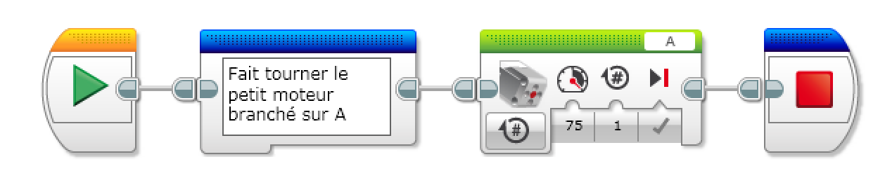

L'action moteur est le troisième bloc, en vert.

Première chose importante, la lettre en haut à droite. Elle doit correspondre à la lettre sur laquelle le moteur est branché. On peut changer la lettre en cliquant dessus et en choisissant une autre valeur.

Ensuite, les options dans le bas du bloc.

Le premier choix à faire est le mode du bloc.

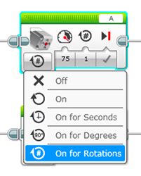

Le bloc moteur a 5 modes :
- activé : le moteur tourne sans s'arrêter;
- désactivé : le moteur ne tourne pas;
- rotations : le moteur tournera un certain nombre de tours. Ce nombre est indiqué par le paramètre en deuxième position. Il est à 1 par défaut;
- secondes : le moteur tournera un certain nombre de secondes. Ce nombre est indiqué par le paramètre en deuxième position. Il est à 1 par défaut;
- degrés : le moteur tournera d'une portion d'un tour indiquée en degrés, par exemple 1/2 tour pour 180° ou 1/4 de tour pour 90°. Il est par défaut à 360°; Ce mode est utilisé pour des déplacements précis comme le mécanisme des pinces ou une tourelle d'observation.

Deux autres paramètres sont présents selon les blocs :
-  la vitesse
-  le freinage

La vitesse peut être un nombre positif ou négatif. Les valeurs négatives sont utilisées pour tourner dans l'autre sens. Cela permet d'ouvrir et fermer une pince en alternant les valeurs, ou bien de faire reculer un véhicule.

Le freinage indique si le moteur doit ralentir avant de s'arrêter ou pas. En général, on ne freine pas lorsque l'on enchaîne avec un autre mouvement.

### Exemples de programmes

On peut mettre plusieurs blocs moteurs à la suite pour faire une action complexe.

Voici un programme qui commande la pince du scorpion.

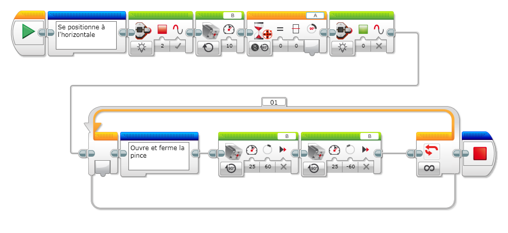

Clique sur l'image pour voir la video

[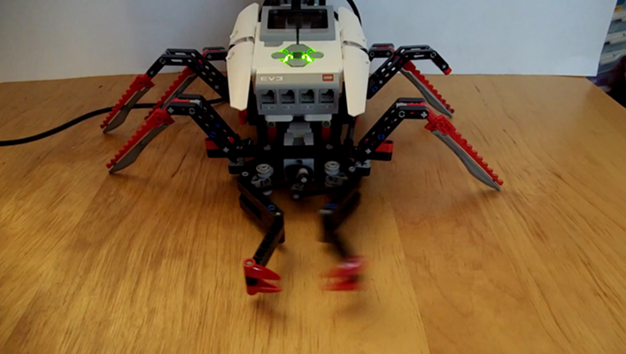](https://raw.githubusercontent.com/cfalguiere/ToutEnAlgo/refonte-home/docs/workshops/mindstorms/bases/moteurs/images/mindstorms_motor_pincer.mp4)

Et un autre programme pour un bus par exemple qui se déplace sur un parcours et  s'arrête aux arrêts de bus.

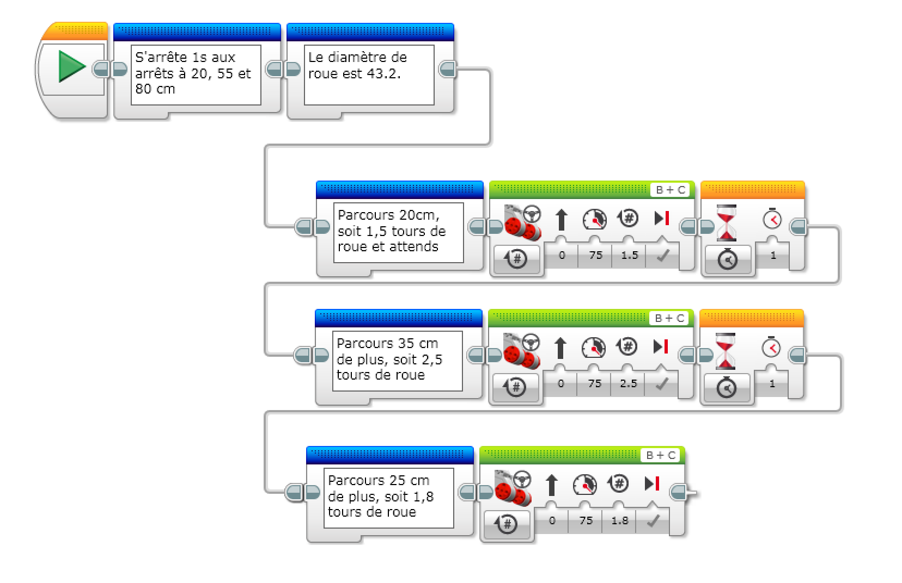

### Points à retenir

- Le moteur doit être branché;
- La lettre du bloc doit correspondre à la lettre où le moteur est branché;
- Il existe plusieurs modes de commande, rotation, secondes, degrés ou activé ou désactivé;
- La vitesse permet de contrôler le sens de rotation;

