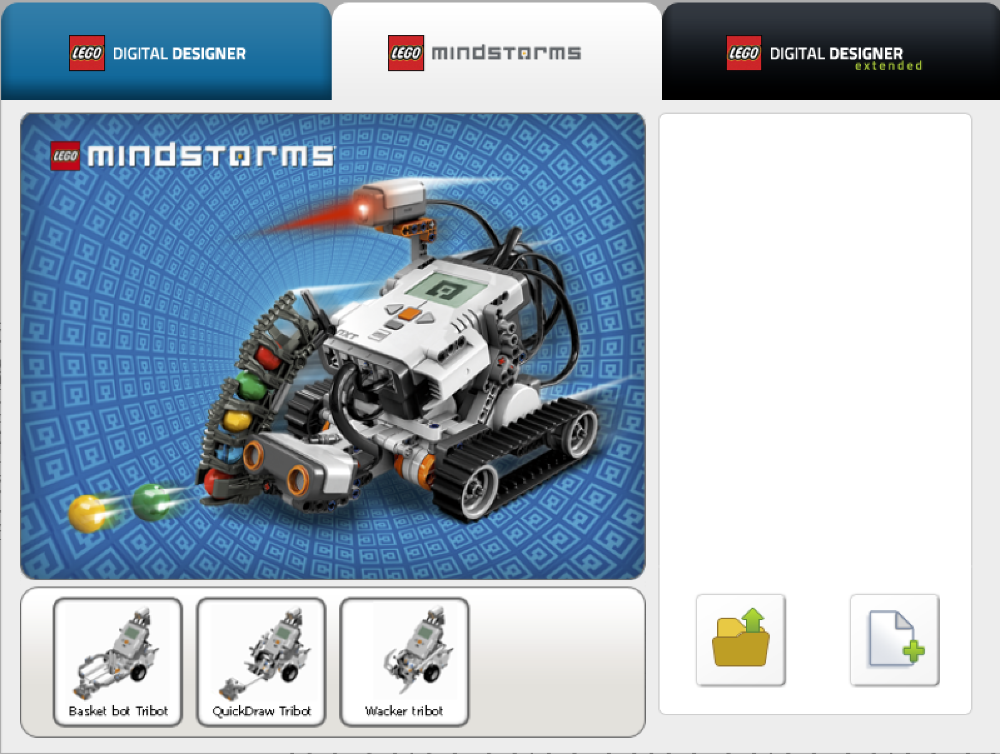
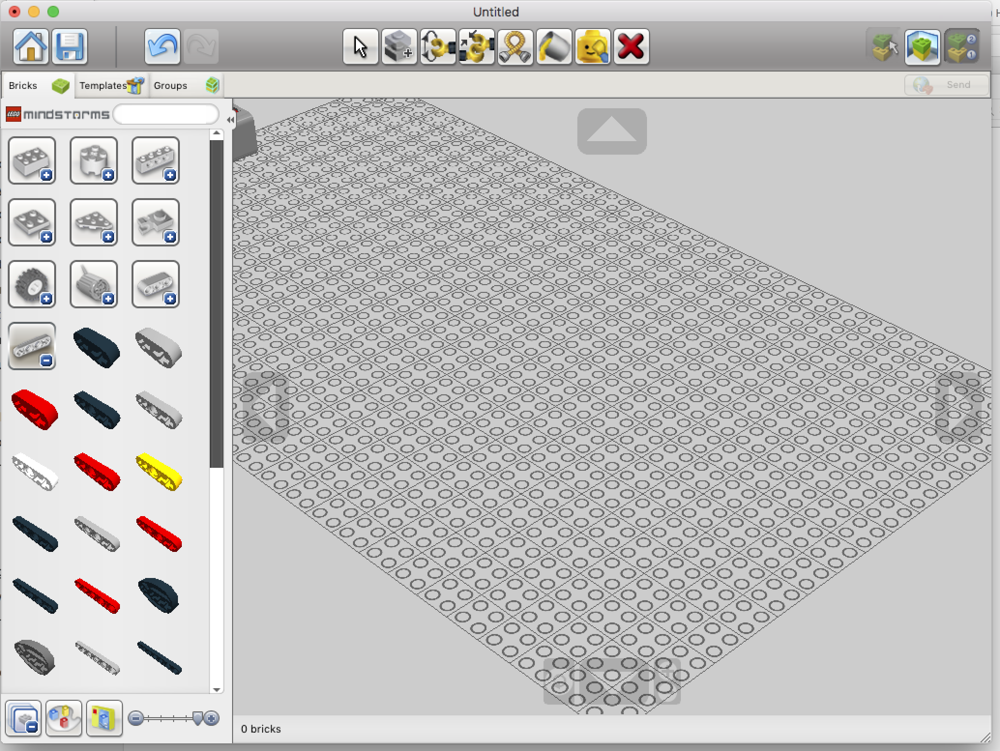

# Mindstorms

## Conception et documentation des modèles

Une fois que vous avez un beau modèle, il est intéressant de le partager avec d'autres.

Vous pouvez partager

- la conception du robot ou d'un mécanisme
- le code du robot

### Le code du robot 

Lorsque vous sauvez le projet que vous avez mis au point Mindstorms App crée un fichier .ev3. Ce fichier contient tous les éléments du projet (le code, mais aussi les fichiers son et les images si besoin).

Un moyen pratique de s'y retrouver est de rajouter des commentaires.

]

Les briques commentaire sont dans le bac bleu

]

Le commentaire général peut être ajouté en utilisant le bouton Commentaire en haut à droite.

]

Il est aussi possible de réorganiser les blocs de manière plus lisible en les dissociant et en tirant des pattes entre les blocs.

]

Enfin le modèle complet peut être documenté dans le Content Editor.

On y accède par le bouton le plus à droite du menu.

Il faut ensuite cliquer sur le crayon pour passer en mode édition. Il se ferme par le bouton "Mindstorms".

### La conception du robot

Lego fourni un outil qui permet de concevoir les montages virtuellement. 

C'est un outil qui ressemble aux outils de CAO (Conception Assistée par Ordinateur) des professionnels, mais en plus simple.

Cet outil permet aussi de générer les instructions de montage que vous avez utilisé comme modèle pour des montages.

Première étape, installer LDD (Lego Digital Designer).

A l'ouverture, le logiciel se place sur le thème LDD qui ne connait que les briques Lego. 

]

Il faut choisir le thème Mindstorm ou LDD Extended pour voir les briques Lego Technic et Mindstorms.

Le bouton avec le plus en bas à droite permet de créer un nouveau modèle.

Un exemple de schéma assez simple :

Un mode d'emploi de LDD (en anglais) 

[Working with Digital Design Tools](https://moc.bricklink.com/pages/moc/help/topic.page?idmochelpcontents=70)

Le mode View ajoute des fons assez moches. Pour générer une vue sans fond, aller dans le mode Build ou Building Guide et utiliser Take a Screenshot dans les menus.