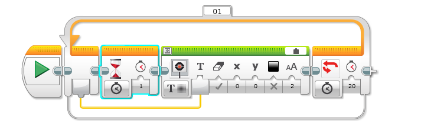

## Compter 20 secondes

Le robot peut afficher des valeurs sur son écran.

Le programme est une boucle. A chaque passage une valeur est augmentée de 1. Cette valeur peut être lue sur le connecteur de la boucle à gauche. Cette valeur est amenée dans l'affichage par le lien en jaune.

Dans la boucle, il faut attendre 1 seconde pour que les nombres ne défilent pas trop vite. C'est le bloc sablier qui fait ça.

La condition d'arrêt de la boucle utilise le temps et la valeur sera 20 pour compter jusqu'à 20.

Il faut paramétrer le bloc affichage pour qu'il affiche du texte. Il faut aussi changer la source dans la barre verte. La valise représente une variable. Ici la variable est le nombre de passages dans la boucle. Tu peut changer la position (x et y), la couleur et la taille du texte.

*_Variante_* : comment peut tu compteur jusqu'à 30 ?
