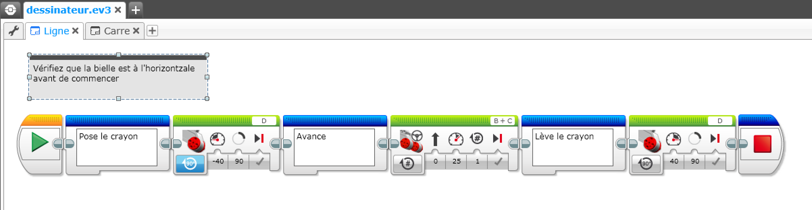
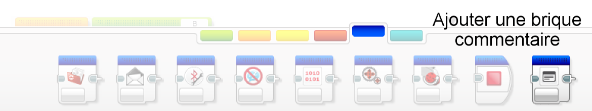
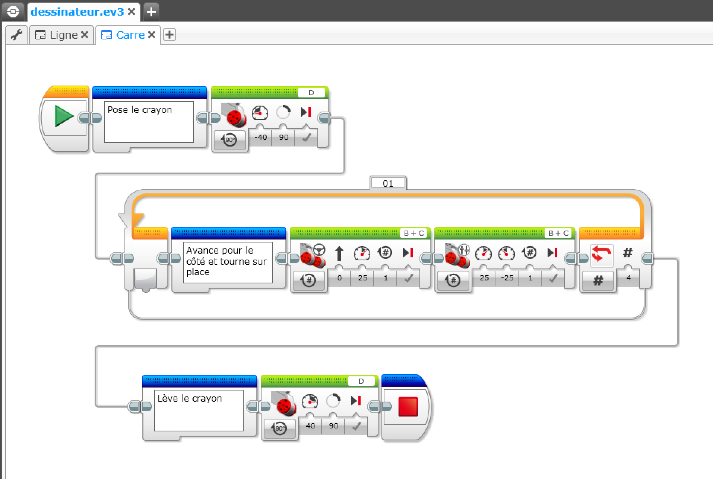

# Mindstorms

### Le code du robot 

Lorsque vous sauvez le projet que vous avez mis au point Mindstorms App crée un fichier .ev3. Ce fichier contient tous les éléments du projet (le code, mais aussi les fichiers son et les images si besoin).

Un moyen pratique de s'y retrouver est de rajouter des commentaires.

]

Les briques Commentaire sont dans le bac bleu

]

Le commentaire général peut être ajouté en utilisant le bouton Commentaire en haut à droite.

]

Il est aussi possible de réorganiser les blocs de manière plus lisible en les dissociant et en tirant des pattes entre les blocs.

]

Enfin le modèle complet peut être documenté dans le Content Editor.

On y accède par le bouton le plus à droite du menu.

Il faut ensuite cliquer sur le crayon pour passer en mode édition. Il se ferme par le bouton "Mindstorms".

