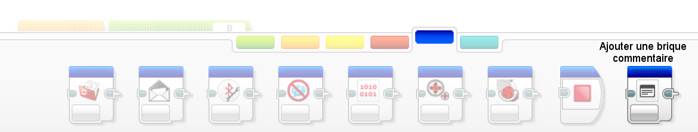
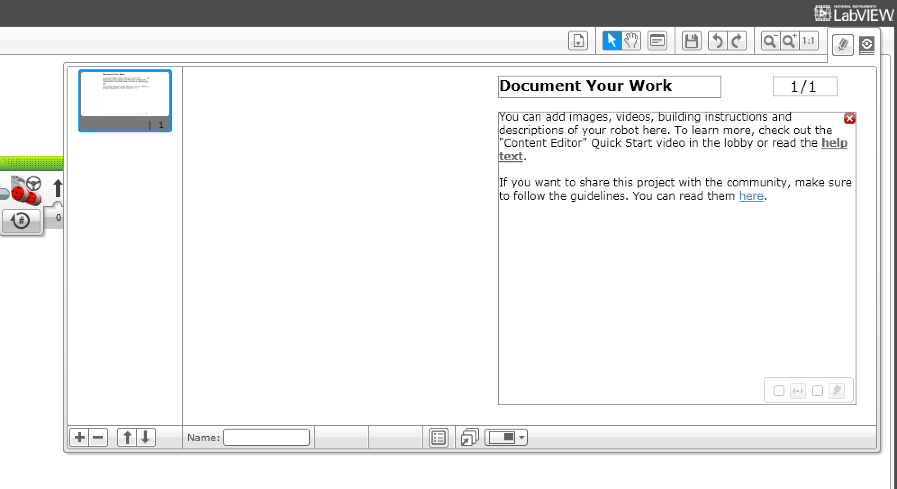

# Mindstorms

## Le code du robot 

Lorsque vous sauvez le projet que vous avez mis au point Mindstorms App crée un fichier .ev3. Ce fichier contient tous les éléments du projet (le code, mais aussi les fichiers son et les images si besoin).

### Les commentaires 

Un moyen pratique de s'y retrouver est de rajouter des commentaires.

Les briques Commentaire sont dans le bac bleu

Le commentaire général peut être ajouté en utilisant le bouton Commentaire en haut à droite de la fenêtre.

### Isoler des sous-ensembles 

Il est aussi possible de réorganiser les blocs de manière plus lisible en isolant des sous ensembles. Les blocs séparés peuvent être reliés en tirant des liens entre les connecteurs. 

### Content Editor 

Enfin le modèle complet peut être documenté dans le Content Editor.

On y accède par le bouton le plus à droite du menu.

Il faut ensuite cliquer sur le crayon pour passer en mode édition.

Il se ferme par le bouton "Mindstorms".

