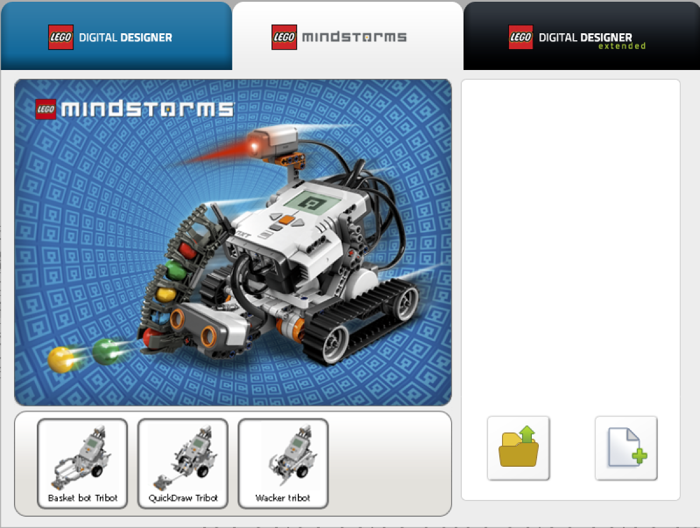
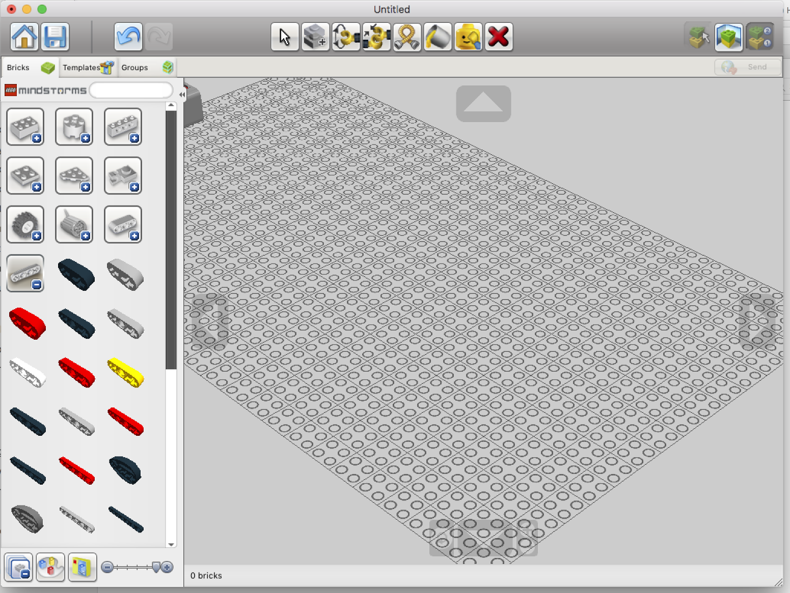
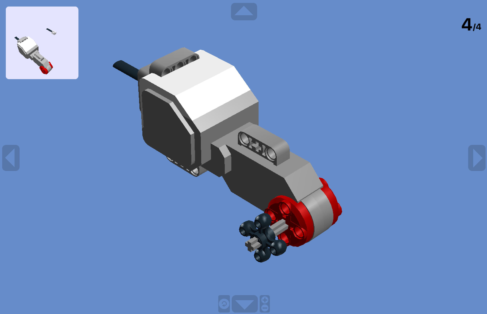

# Mindstorms

### La conception du robot

Lego fourni un outil qui permet de concevoir les montages virtuellement. 

C'est un outil qui ressemble aux outils de CAO (Conception Assistée par Ordinateur) des professionnels, mais en plus simple.

Cet outil permet aussi de générer les instructions de montage que vous avez utilisé comme modèle pour des montages.

Première étape, installer LDD (Lego Digital Designer).

A l'ouverture, le logiciel se place sur le thème LDD qui ne connait que les briques Lego. 

]

Il faut choisir le thème Mindstorms ou LDD Extended pour voir les briques Lego Technic et Mindstorms.

Le bouton avec le plus en bas à droite permet de créer un nouveau modèle.

Un exemple de schéma assez simple :

Un mode d'emploi de LDD (en anglais) 

[Working with Digital Design Tools](https://moc.bricklink.com/pages/moc/help/topic.page?idmochelpcontents=70)

Le mode View ajoute des fonds assez criards. Pour générer une vue sans fond, aller dans le mode Build ou Building Guide et utiliser Take a Screenshot dans les menus. Le fond est transparent.

Ce modèle peut être diffusé en HTML ou en PDF et inclus dans le Content Editor du projet.