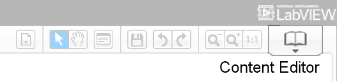

# Mindstorms

----

## Le Content Editor 

Le projet complet peut être documenté dans le Content Editor.

Cet outil permet de créer une documentation de plusieurs pages qui indique comment monter le modèle, comment l'utiliser et peut renvoyer à d'autres ressources pour le support.

Si vous voulez livrer un projet officiel, il est nécessaire de compléter cette partie du projet.
 

 

On y accède par le bouton le plus à droite du menu.

Il faut ensuite cliquer sur le crayon pour passer en mode édition.

Il se ferme par le bouton "Mindstorms".

----

[Retour](index.md)
