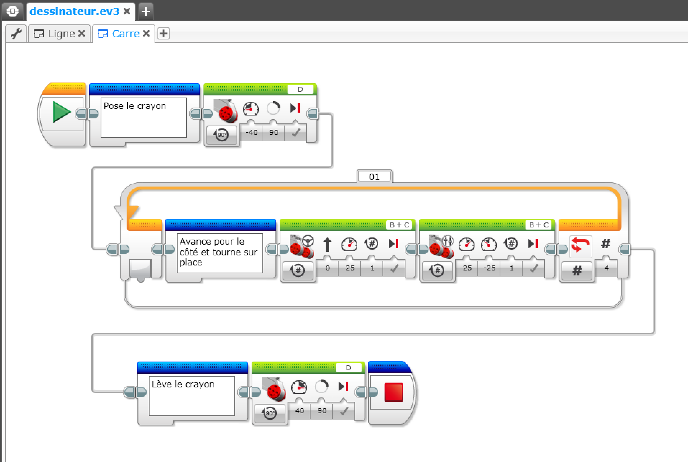

# Mindstorms

----

## Bien présenter le programme du robot 

----

### Donner un nom parlant aux programmes

Par défaut Mindstorms App, nomme le projet project.ev3 et les programmes programme1, programme1 ...

Vous pouvez changer le nom des programmes en sélectionnant l'onglet et en remplaçant le nom.

Pour renommer le projet, il faut le sauver sous un autre nom.

----

### Isoler des sous-ensembles 

Un programme est souvent constitué de plusieurs étapes.

Par exemple :

- poser le stylo
- dessiner un carré
- lever le stylo

Sur le programme ci-dessous, on voit tout de suite ces trois étapes :

Le programme est plus lisible lorsque les blocs sont isolés en sous-ensembles.

Les blocs qui réalisent la même étape (par exemple faire un carré) sont collés. 

Les sous-ensembles de blocs sont reliés en utilisant les connecteurs. Pour créer un lien, il faut se placer sur le connecteur d'un bloc et tirer un lien jusqu'au connecteur du bloc suivant. 

----

### Les commentaires 

Un moyen pratique de transmettre des informations au bon endroit est de rajouter des commentaires.

Les commentaires peuvent porter sur l'ensemble du programme

Par exemple 

- décrire ce que fait le programme
- donner des indications sur les points à vérifier avant de démarrer le programme

Ces commentaires sont détachés du programme.

D'autres commentaires peuvent être ajoutés dans le programme pour nommer ou décrire les étapes. Ils permettent de s'y retrouver dans le programme.

 

Les briques Commentaire sont dans le bac bleu

Le commentaire général peut être ajouté en utilisant le bouton Commentaire en haut à droite de la fenêtre.

----

[Retour](index.md)
