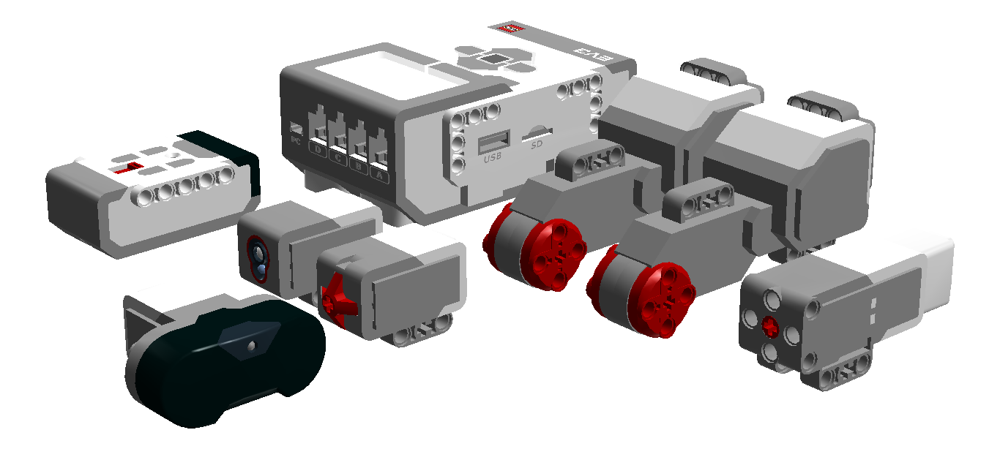
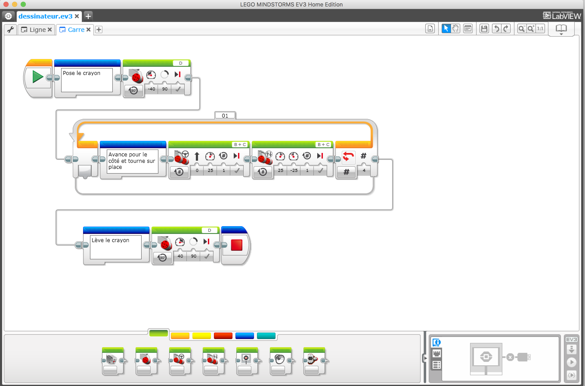
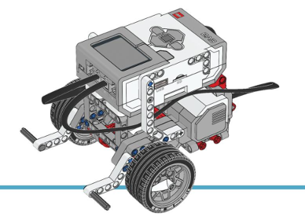

# Mindstorms

    Robotique
    à partir de 9 ans
    programmation par bloc ou langage de programmation
    un peu moins de 300€ par robot
    

Le Kit Lego Mindstorms EV3 est composé de pièces Lego Technic et de composants robotique : une brique de contrôle, des moteurs, des capteurs et une balise/télécommande infrarouge 

Les programmes sont écrits en utilisant des blocs avec un des logiciels de programmation EV3 téléchargeavble sur le site

L'objectif est d'apprendre les bases de la programmation et de la robotique au travers de modèles fournis avec le kit, par la communauté, ou en faisant ses propres expérimentation. 

Le kit peut être étendu avec des pièces Lego Technic et d'autres capteurs. Il existe aussi des extensions du firmware pour programmer en C, Python, Java et l'intégrer avec d'autres systèmes électroniques ou de traitement de données.

Les différents concours de robotique peuvent fournir des objectifs de progression.

 
Le site officiel Lego

[Lego Mindstorms](https://www.lego.com/fr-fr/mindstorms)

----

## Le rover de base

Le kit est fourni avec des modèles complètement documenté. Pour faire des expérimentations on va partir de modèles plus simples et modulables. 

Le modèle le plus simple pour commencer un projet est le rover. Il est simple et rapide à monter conçu pour intégrer facilement les divers capteurs.

 

[Monter le Rover](rover/index.html) 

----

## Faire un véhicule

[Utiliser les moteurs](bases/moteurs/les_moteurs.md)

[Changer de direction](vehicules/changer_de_direction.md)

[Avancer jusqu'à la balise](avancer_jusqua_balise.md)

## Répéter une opération

[Compter 20 secondes](compter_20_secondes.md)

## Les capteurs

[Afficher la valeur d'un capteur](afficher_valeur_capteur.md)

## Le robot qui dessine

[Smiley](robot-qui-dessine/smiley.md)

----

## Conception et documentation des modèles

Une fois que vous avez un beau modèle, il est intéressant de le partager avec d'autres.

Vous pouvez partager

- la conception du robot ou d'un mécanisme
- le code du robot

[Conception et documentation](concepteur/index.md)

----

[Retour](../../index.md)
