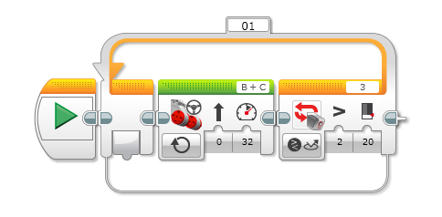

# Mindstorms

## Avancer jusqu'à la balise

Pour détecter la balise on va utiliser le capteur de lumière.
Le programme est une boucle qui avance un peu puis vérifie le capteur de lumière.
La balise est blanche et lorsqu'on s'approche de la balise, la quantité de lumière réfléchie augmente et fini par dépasser 20.  Cette condition va arrêter la boucle.

Selon les prises sur lesquelles tu as branché les moteurs et les capteurs sur ton robot, les lettres affectées aux moteurs (B+C) et le chiffre affecté au capteur (3) peuvent être un peu différents.

Selon la lumière dans la pièce, il peut être nécessaire de changer la limite au delà de laquelle le robot s'arrête (ici 20)
