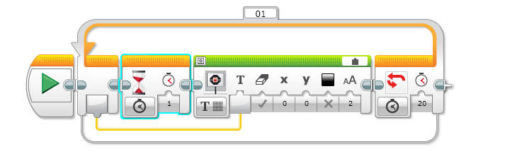
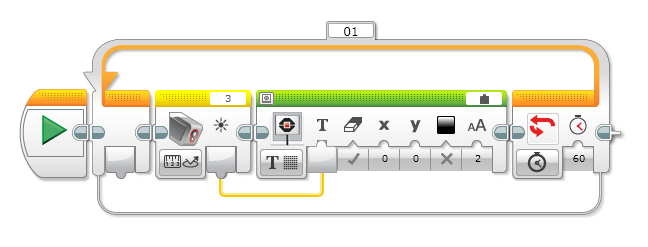

# Mindstorms

## Avancer jusqu'à la balise

Pour détecter la balise on va utiliser le capteur de lumière.
Le programme est une boucle qui avance un peu puis vérifie le capteur de lumière.
La balise est blanche et lorsqu'on s'approche de la balise, la quantité de lumière réfléchie augmente et fini par dépasser 20.  Cette condition va arrêter la boucle.

Selon les prises sur lesquelles tu as branché les moteurs et les capteurs sur ton robot, les lettres affectées aux moteurs (B+C) et le chiffre affecté au capteur (3) peuvent être un peu différents.

Selon la lumière dans la pièce, il peut être nécessaire de changer la limite au delà de laquelle le robot s'arrête (ici 20)

## Compter 20 secondes

Le robot peut afficher des valeurs sur son écran.

Le programme est une boucle. A chaque passage une valeur est augmentée de 1. Cette valeur peut être lue sur le connecteur de la boucle à gauche. Cette valeur est amenée dans l'affichage par le lien en jaune.

Dans la boucle, il faut attendre 1 seconde pour que les nombres ne défilent pas trop vite. C'est le bloc sablier qui fait ça.

La condition d'arrêt de la boucle utilise le temps et la valeur sera 20 pour compter jusqu'à 20.

Il faut paramétrer le bloc affichage pour qu'il affiche du texte. Il faut aussi changer la source dans la barre verte. La valise représente une variable. Ici la variable est le nombre de passages dans la boucle. Tu peut changer la position (x et y), la couleur et la taille du texte.

*_Variante_* : comment peut tu compteur jusqu'à 30 ?

## Afficher la valeur d'un capteur

Pour afficher la valeur du capteur de lumière, on va relier l'écran du robot.

Le programme est une boucle. A chaque passage, le capteur est lu et sa valeur est affichéee. La valeur du capteur est amenée dans l'affichage par le lien en jaune.

La condition d'arrêt de la boucle utilise la durée et la valeur est 60 pour 60 secondes.

Il faut paramétrer le bloc affichage pour qu'il affiche du texte. Il faut aussi changer la source dans la barre verte. La valise représente une variable. Ici la variable est la valeur lue par le capteur. Tu peut changer la position (x et y), la couleur et la taille du texte.

Selon les prises sur lesquelles tu as branché le capteur sur ton robot,  le chiffre affecté au capteur (3) peuvent être un peu différent.

*_Variante_* : essaye avec différents capteurs

