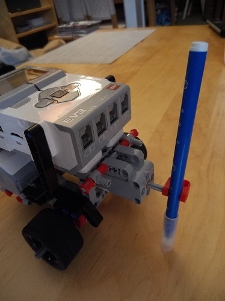
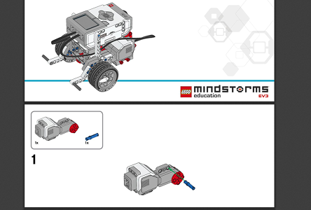

# Mindstorms > Le robot qui dessine

## Le smiley

Ce programme a été réalisé lors du CodeDojo Paris le 18 Mars par Héma, 9 ans.
L'atelier a pris environ 3h (incluand le goûter).

## Le matériel

Pour ce montage il faut

- un robot sur roue
- un petit moteur pour poser et lever le stylo
- un cable
- un stylo feutre
- quelques pièces pour attacher le moteur et le stylo
- une grande feuille de papier (un format A2 ou Raisin, ou une feuille de paper board)

Le montage fini ressemble à ça

Nous avons utilisé le montage du robot Educator du kit Mindstorms Education adapté pour le kit Mindstorms Home Edition. Il faut une roue folle à l'arrière. Elle peut être achetée facilement. Une autre option est la remplacer par un axe vertical et une petite roue verticale qui peut se tourner librement autour de l'axe vertical pour se mettre dans le sens de déplacement.

Le plan de montage du rover :

## Les étapes

La conception du smiley nécessite plusieurs étapes

- comprendre comment attacher le stylo
- comprendre comment faire un cercle
- comprendre comment poser et lever le stylo
- comprendre comment faire les yeux et la bouche

### attacher le stylo

Le rover a un cadre vide à l'avant. Le petit moteur est placé dans le cadre et il est suspendu par le haut. N'oubliez pas de brancher le cable à l'arrière.

Pour ce premier atelier, on va faire un mécanisme assez simple qui lève le stylo sur le côté. De cette manière, il suffira de faire tourner un peu le moteur pour lever le stylo.

Par chance le stylo avait la bonne taille pour tenir coincée dans la pièce attachée au moteur. Une autre solution aurait pu être d'utiliser l'élastique pour tenir un peu mieux le stylo.

## faire un cercle

Le premier programme a permis de valider que l'on peut faire un cercle en faisant tourner le robot.

Si tu n'as jamais utiisé les moteurs tu peux regarder les pages suivantes :

- [Utiliser les moteurs](../bases/moteurs/les_moteurs.md)
- [Changer de direction](../vehicules/changer_de_direction.md)

Ce programme utilise un bloc Tank avec seulement une roue qui tourne. Le centre du cercle va être à peu près là où se trouve la roue qui ne tourne pas.
Le diamètre du cercle est fixé par l'écart entre la roue intérieure et le stylo.

Il faut quelques essais pour déterminer le nombre de rotations nécessaires pour faire un cercle complet. Si besoin, on peut faire des portions de rotations. Attention, le signe décimal est le signe . (point).

On a baissé la vitesse du robot pour mieux contrôler les mouvements, mais il fait éviter les vitesses trop basses. Le stylo frotte un peu et si la vitesse est trop basse le robot n'avance plus droit.

On a gardé ce programme pour pouvoir faire les démos en attendant que le programme complet soit terminé.

## faire les yeux et la bouche

Un deuxième programme a permis de tester le lever de stylo.

Le crayon est positionné manuellement à la verticale et à la bonne hauteur pour écrire.

On va utiliser le moteur en mode dégrés pour lever le stylo. 30° à 40° suffisent.
Pour le reposer, il faut le déplacer exactement en sens inverse.

Ici aussi on a utilisé une vitesse assez basse pour éviter d'éjecter le stylo.

Un petit inconvénient de cette solution est que le stylo écrit pendant qu'il se lève et quand on le repose. Celà ne permet pas de faire un dessin précis, mais ça donné un air cool et un peu lunatique au smiley.

## dessiner les yeux et la bouche

Un troisième programme reprend le tout.

Les yeux et la bouche sont des traits droits. On va utiliser des blocs Volant dans ce cas car on n'a pas à gérer la direction.

Pour se positionner pour le premier oeil le robot recule en tournant un peu. On a choisi un bloc Tank et changé les vitesses pour avoir le bon virage.

Ensuite le robot pose le stylo, avance en ligne droite pour faire le premier oeil, relève le stylo, avance de l'espace entre les deux yeux, repose le stylo et avance en ligne droite pour le second oeil.

Il faut ensuite se positionner un peu plus bas pour faire la bouche. le robot fait une sorte de S, en reculant en tournant d'abord dans un sens puis dans l'autre. Il se retrouve alors plus ou moins parallèle à la ligne des yeux. Il pose le stylo, avance en ligne droite et relève le stylo.

## les améliorations possibles

L'atelier se terminait et on a dû finir là pour partir faire la démo.

Un point à améliorer est que le robot reste sur le dessin. Il faudrait déplacer le robot en avant ou en arrière pour qu'il permette de voir le dessin.

On pourrait concevoir un mécanisme plus complexe pour soulever le stylo à la verticale et éviter les traits parasites.

Enfin on pourrait utiliser le capteur de position du moteur pour d'assurer que le stylo est vertical au départ.
