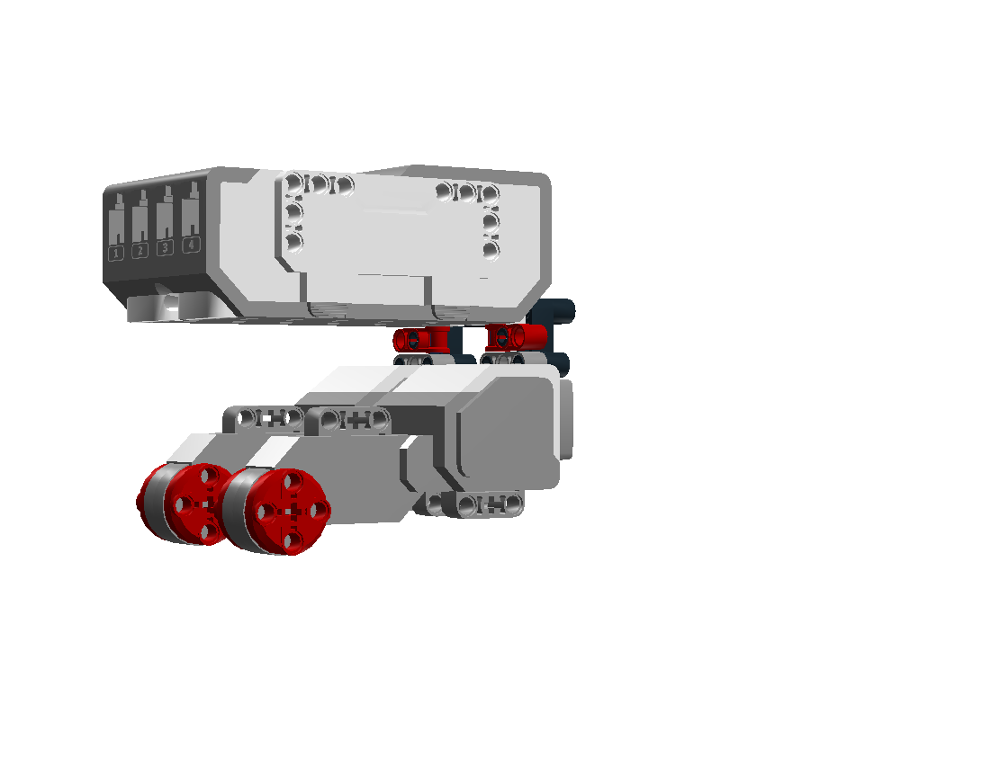
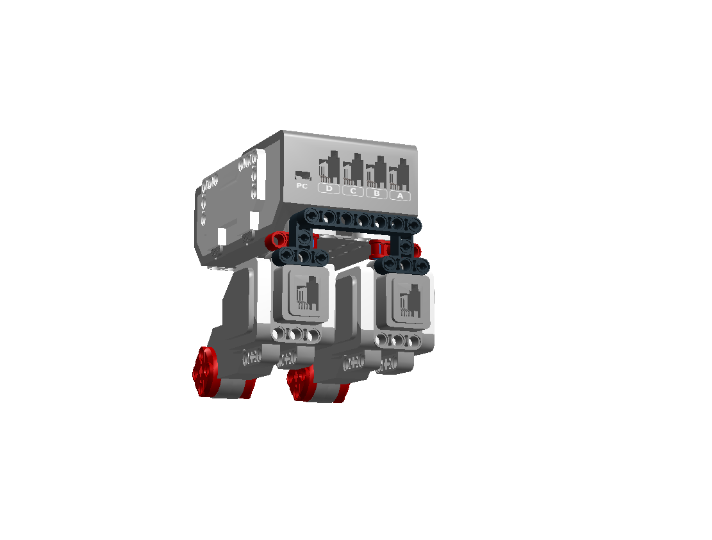

# Mindstorms 

----

## Le rover 

Le kit Education fourni un montage de rover simple et rapide à monter. Le plan de montage contient aussi les instructions pour intégrer les divers capteurs.

Il est en gros utilisable avec le kit commercial. Toutefois il manque quelques pièces. Des instructions complémentaires sont fournies à la fin de cette page.
 
Les étapes modifiées sont 

- l'attache de la roue folle de l'étape 24 à l'étape 34
- la pose de la brique de contrôle de l'étape 36 à l'étape 39

----

### Le plan de montage du rover Education:

----

### L'attache de la roue folle

La roue folle n'est pas fournie dans le kit commercial. Elles s'achètent par 2 pour une dizaine d'euros.

En revanche, la piece en angle n'est pas fournie. 

Il est important que la roue folle ne soit pas trop en arrière pour bien soutenir le robot.

Vous pouvez utiliser un montage de ce type.

<iframe src="html/Building Instructions [rover-roue-folle].html" scrolling="auto" name="iframe" height="800" width="100%"></iframe>

Si vous n'avez pas de roue folle, vous pouvez utiliser un montage de ce type. Il faut s'assurer qu'il tourne bien sur tous les axes.

----

### La pose de la brique de contrôle

La pièce en angle qui attache l'arrière de la brique de contrôle n'est pas fournie. 

Le montage doit compenser une rangée et attacher la brique dec contrôle aux moteurs.

Vous pouvez utiliser un montage de ce type.

  

<iframe src="html/Building Instructions [rover-pose-brique].html" scrolling="auto" name="iframe" height="800" width="100%"></iframe>

La barre n'est pas indispensable. Elle permet de tenir les cables.

----

### Quelques trucs et astuces

Un truc assez pratique pour tenir les cables est de rajouter des taquets.

----
[Retour](../index.md)
