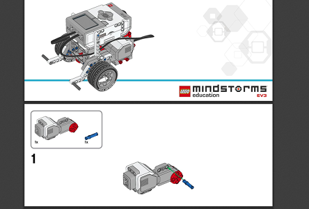
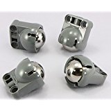
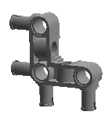
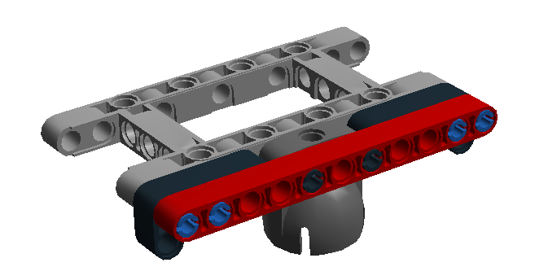
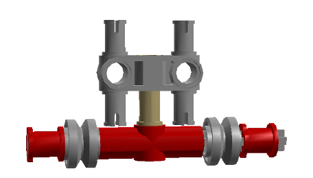
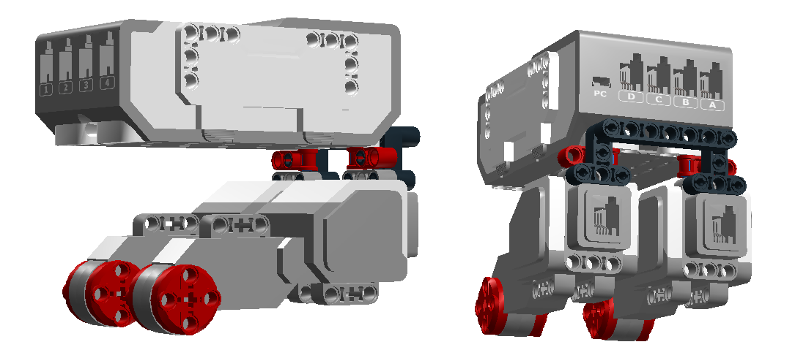
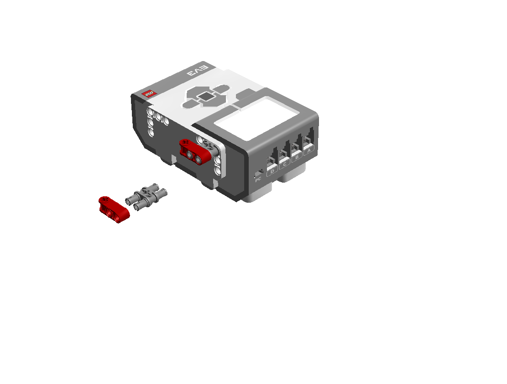

# Mindstorms 

----

## Le rover 

Le kit Education fournit un montage de rover simple et rapide à monter. Le plan de montage contient aussi les instructions pour intégrer les divers capteurs.

Il est en gros utilisable avec le kit commercial. Toutefois il manque quelques pièces. 

On va voir comment adapter le montage pour le kit EV3 commercial. Des instructions complémentaires sont fournies à la fin de cette page.
 
Les étapes modifiées sont :

- l'attache de la roue folle de l'étape 24 à l'étape 34
- la pose de la brique de contrôle de l'étape 36 à l'étape 39

----

### Le plan de montage du rover Education

Suivez les instructions jusqu'à l'étape 23 

----

### L'attache de la roue folle

  

 

Le rover Educator utilise une roue folle (back caster en anglais). C'est une pièce dans laquelle on insère une bille qui tourne librement. Cette roue est donc mobile dans toutes les directions et ne freine pas le robot.

La roue folle n'est pas fournie dans le kit commercial. Elles s'achètent par 2 pour une dizaine d'euros.

Le rover Educator utilise aussi une piece en angle qui n'est pas fournie.  

On va utiliser un autre système d'attache, par exemple un montage de ce type. Il est important que la roue folle ne soit pas trop en arrière du chassis pour bien soutenir le robot et que sa fixation soit rigide.

[Plan de montage](html/Building Instructions [rover-roue-folle].html")

Si vous n'avez pas de roue folle, vous pouvez utiliser un montage de ce type. Il faut s'assurer qu'il tourne bien sur tous les axes.

----

### La pose de la brique de contrôle

Le rover Educator utilise aussi une piece en angle qui n'est pas fournie.  

Cette pièce sert à compenser une rangée et attacher la brique de contrôle aux moteurs à l'arrière du robot.

Vous pouvez utiliser un montage de ce type.

 

<frameset cols="100%">
<frame src="html/Building Instructions [rover-pose-brique].html" />
</frameset>

La barre  à l'arrière n'est pas indispensable. Elle permet de tenir les cables.

----

### La suite du montage du rover Education

Reprennez les instructions à l'étape 40 

----

### Quelques trucs et astuces

Un truc assez pratique pour tenir les cables est de rajouter des taquets.

----
[Retour](../index.md)
