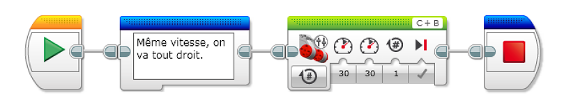
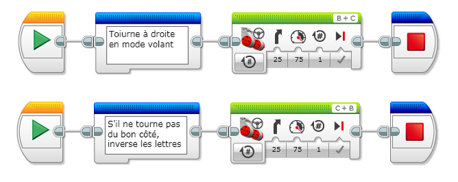

# Mindstorms

## Changer de direction

Dans une voiture on utilise le volant pour changer de direction. Le volant modifie l'angle des roues. Toutes les roues sont commandées par le même moteur mais la modification de l'angle des roues permet d'aller dans la direction souhaitée. En complément un mécanisme modifie la vitesse de chaque roue pour que le mouvement soit fluide.

Sur un robot rover ce mécanisme serait très compliqué à monter. On utilise en général un système plus simple. Chaque côté à un moteur et on joue sur la vitesse des moteurs pour changer la direction.

Si tu n'as pas encore utilisé de moteurs, il est préférable de commencer par l'épisode qui présente les moteurs. Il présentera les modes d'utilisation et les options des blocs moteur.
[Utiliser les moteurs](../bases/moteurs/les_moteurs.md)

Si tout est clair nous allons voir comment utiliser deux moteurs pour faire tourner le véhicule.

### Comment tourner ?

Si les moteurs de chaque côté vont à la même vitesse, ils parcourent le même chemin dans un temps donné et on va tout droit.
Si le moteur à droite va plus lentement, on aura fait moins de chemin à droite qu'à gauche et de fait on aura tourné à droite.

Pour faciliter ces commandes, deux blocs de la zone action en vert permettent de contrôler deux moteurs en même temps.

### Le bloc Moteur en mode Tank

Un bloc permet de contrôler séparément la vitesse de chaque moteur. C'est le mode Tank.

Si on veut aller tout droit les deux moteurs ont la même vitesse.

Si on veut aller à droite le moteur droit tourme plus lentement.

A ton avis comment fait-on pour aller à gauche ?
Et et bien si i on veut aller à gauche .... le moteur gauche doit tourner plus lentement.

### Aller dans la bonne direction

Le bloc indique en haut à droite les lettres des deux moteurs contrôlés. Il faut faire attention à connecter les moteurs sur les bonnes lettres, mais aussi dans le bon ordre. ici B+C n'a pas le même sens que C+B.

A ton avis que signifie l'ordre des lettres ?

La première lettre indique le moteur à gauche et la seconde le moteur à droite.

Selon la façon de placer les moteurs et la brique de contrôle dans le montage, il se peut que le déplacement ne soit pas très logique. En particulier, les ports A, B, C, D peuvent être à l'avant ou à l'arrière. Selon la direction du robot par rapport au sens de la brique, il peut avoir l'air de tourner dans le mauvais sens.

Dans ce cas il faut simplement inverser les lettres pour que le déplacement soit logique. Vérifie quand même que ce ne sont pas les cables qui sont inversés. Ton montage sera plus simple à comprendre si chaque moteur est branché sur une lettre qui se trouve du même côté que lui.

### Le bloc Moteur en mode Volant

J'avais parlé d'un autre bloc, c'est le bloc Volant. Dans ce bloc, on indique dans quel sens on veut tourner, et c'est le robot qui va calculer les vitesses des moteurs pour arriver au bon résultat.

Le paramètre permet d'indiquer si l'on veut tourner à gauche ou à droite, et aussi de quel angle on veut tourner. Ici aussi, il faut faire attension à l'ordre des lettres.

### Quel bloc utiliser ?

Le bloc Volant est plus simple à utiliser lorsque l'on veut déplacer un véhicule sans trop de contraintes.

Le bloc Tank permet des déplacements plus précis. Il permet de contrôler finement le rayon de braquage et même de faire tourner le véhicule sur lui même.

Le rayon de braquage diminue lorsque l'écart entre les vitesses augmente. A l'extrême, si un moteur tourne dans un sens et l'autre en sens inverse, le robont tourne sur lui même.

### Points à retenir

- Le bloc Volant permet de tourner en indiquant seulement l'angle
- Le bloc Tank permet de contrôler chaque moteur et tourner sur place
- Attention à l'ordre des lettres
- Si le robot ne tourne pas dans le bon sens, inverse les lettres

