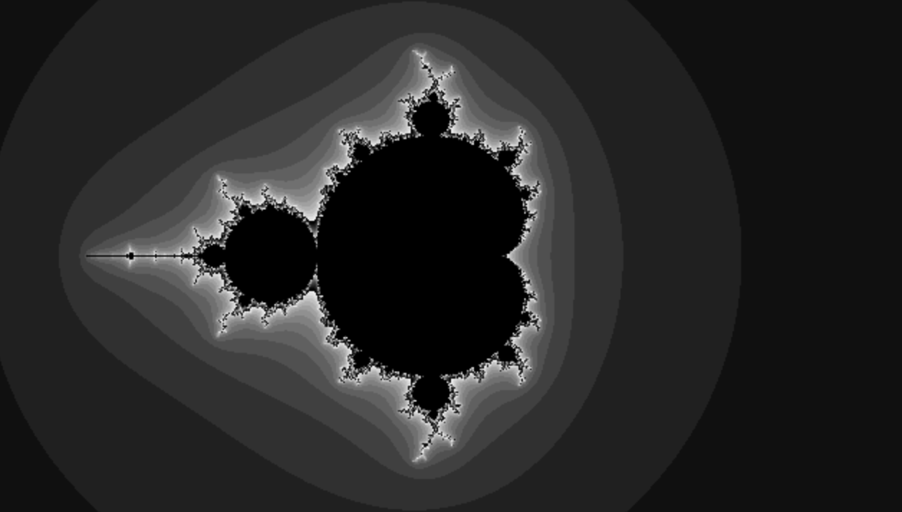

# Processing

    Programmation 
    à partir de 10 ans
    programmation par langage de programmation 
    gratuit
    

Processing est un logiciel destiné à la création d''images de synthèse et d'animations en particulier dans le domaine scientifique ou artistique.

L'installation et la programmation sont simples à apprendre.  

Il s'appuie sur les langages Java, JavaScript ou Python et il permet d'apprendre ces langages en faisant des choses cool, en particulier si on aime dessiner.

Processing peut être installé sur le poste ou utilisé en ligne.

 
Le site officiel Processing

[Processing](https://processing.org/)

Galerie

[OpenProcessing](https://www.openprocessing.org/)

Editeur Processing en ligne

[SketchPad](http://sketchpad.cc/)

----

## Créer un jeu pas à pas

Un tutorial documenté a été crée pour la présentation de la Leap Motion. La Leap Motion n'est pas nécessaire pour les premières étapes du tutorial.

Il utilise le moteur physique 2D Hermes. 

L'installation de Hermes et la programmation pas à pas

[sources](https://github.com/cfalguiere/Air-Breakout)

Présentation de Hermes

[Présentation](http://cfalguiere.github.io/Presentations/Pres-Processsing-Hermes-Leap/index.html#/)

----

[Retour](../../index.md)
